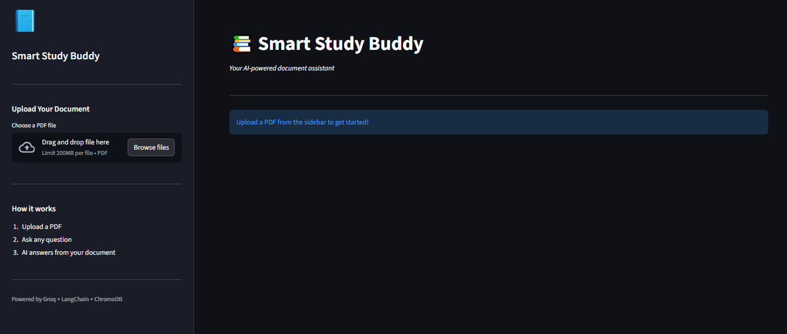
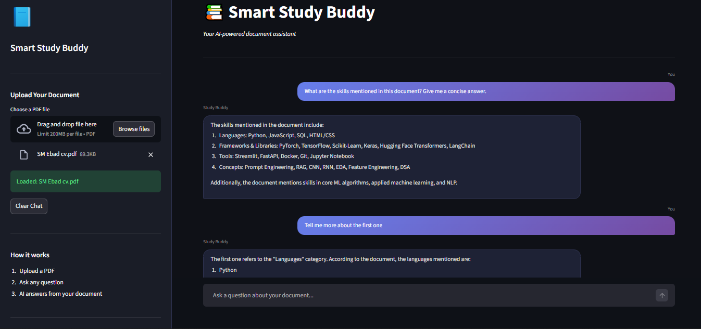

# 📚 Smart Study Buddy

[](https://www.python.org/downloads/)
[](https://streamlit.io)
[](https://groq.com)
[](https://langchain.com)
[](https://chromadb.com)
[](LICENSE)

> Upload any PDF and have a real conversation with it. Ask questions, get instant answers, and follow up naturally — all powered by RAG architecture and Groq's free Llama 3.3-70B model.

---

## 📸 Final Outcome of the App

### 🖥️ Application Interface



### 💬 Conversational Q&A in Action



---

## ✨ Features

- 📄 **PDF Upload** - Upload any textbook, notes, resume, or research paper
- 💬 **Conversational Memory** - Ask follow-up questions naturally, just like ChatGPT
- 🧠 **RAG Architecture** - Only relevant chunks sent to AI, saving API calls and cost
- 🎨 **Beautiful Dark UI** - WhatsApp-style chat bubbles with a modern dark theme
- ⚡ **Lightning Fast** - Powered by Groq's ultra-fast inference engine
- 🆓 **100% Free** - HuggingFace embeddings run locally, Groq free tier for LLM
- 🔒 **Secure** - API keys never exposed, stored locally in `.env`
- 🗂️ **Smart Chunking** - PDF split into 500-char chunks for precise retrieval

---

## 🎯 Demo

### Sample Interaction

```
User:   What are the skills mentioned in this document?
Buddy:  The document mentions Python, Machine Learning, NLP, and LangChain...

User:   Tell me more about the first one
Buddy:  Regarding Python, the document highlights...  ← follow-up works!

User:   What projects are listed?
Buddy:  The document mentions the following projects...
```

🔗 **[View Live Demo](https://smebad-smart-study-buddy-app-igvklp.streamlit.app/)**

---

## 🛠️ Tech Stack

| Technology | Purpose |
|------------|---------|
| **Python 3.8+** | Core programming language |
| **Streamlit** | Web framework and UI |
| **Groq API** | AI model inference (Llama 3.3-70B) |
| **LangChain** | RAG pipeline orchestration |
| **HuggingFace Embeddings** | Local text embeddings (free, no API needed) |
| **ChromaDB** | Local vector database for chunk storage |
| **python-dotenv** | Environment variable management |

---

## 🧠 How It Works (RAG Architecture)

```
PDF Uploaded
     ↓
Split into 500-char chunks
     ↓
Each chunk converted to vector embeddings (HuggingFace, runs locally)
     ↓
Stored in ChromaDB (local vector database)
     ↓
User asks a question
     ↓
Top 3 most relevant chunks retrieved
     ↓
Chunks + conversation history sent to Groq (Llama 3.3-70B)
     ↓
Answer returned with full conversational memory
```

---

## 📋 Prerequisites

- Python 3.8 or higher
- pip (Python package manager)
- A free Groq API key

---

## 🚀 Installation & Setup

### 1️⃣ Clone the Repository

```bash
git clone https://github.com/smebad/Smart-Study-Buddy.git
cd smart-study-buddy
```

### 2️⃣ Create Virtual Environment

**Windows (Git Bash):**
```bash
python -m venv venv
source venv/Scripts/activate
```

**Mac/Linux:**
```bash
python3 -m venv venv
source venv/bin/activate
```

### 3️⃣ Install Dependencies

```bash
pip install streamlit langchain langchain-community langchain-groq chromadb sentence-transformers pypdf python-dotenv langchain-text-splitters langchain-core --timeout 300
```

### 4️⃣ Set Up Environment Variables

Create a `.env` file in the root folder:

```env
GROQ_API_KEY=your_actual_groq_api_key_here
```

**How to get your free Groq API key:**

1. Visit [console.groq.com](https://console.groq.com)
2. Sign up (no credit card required)
3. Navigate to **"API Keys"**
4. Click **"Create API Key"**
5. Copy and paste into your `.env` file

### 5️⃣ Run the Application

```bash
streamlit run app.py
```

---

## 📖 Usage Guide

### Step 1: Upload Your PDF
Drag and drop any PDF into the sidebar uploader — textbooks, notes, research papers, resumes, anything!

### Step 2: Wait for Indexing
The app splits your PDF into chunks and indexes them locally. The first run downloads the embedding model (~80MB, one time only). After that it's instant.

### Step 3: Start Chatting
Type your question in the chat box and get instant answers from your document. Ask follow-up questions naturally — the app remembers the full conversation context!

---

## 📁 Project Structure

```
smart-study-buddy/
│
├── app.py              # Main Streamlit application
├── .env                # API key
├── .gitignore          # Git ignore rules
├── README.md           # Project documentation
└── assets/
    ├── screenshot1.png # App UI screenshot
    └── screenshot2.png # Chat in action screenshot
```

---

## 🔧 Configuration

### Changing the AI Model

Edit `app.py` to switch to a different Groq model:

```python
llm = ChatGroq(
    model_name="llama-3.3-70b-versatile",  # Default (best quality)
    # Alternatives:
    # model_name="llama-3.1-8b-instant"    # Faster, lighter
    # model_name="mixtral-8x7b-32768"      # Good alternative
)
```

### Adjusting Chunk Size

Edit the splitter settings in `app.py` to control how the PDF is split:

```python
splitter = RecursiveCharacterTextSplitter(
    chunk_size=500,    # Increase for more context per chunk
    chunk_overlap=50   # Increase for better continuity between chunks
)
```

---

## 🤝 Contributing

Contributions are welcome! Here's how you can help:

1. **Fork the repository**
2. **Create a feature branch**
   ```bash
   git checkout -b feature/AmazingFeature
   ```
3. **Commit your changes**
   ```bash
   git commit -m 'Add some AmazingFeature'
   ```
4. **Push to the branch**
   ```bash
   git push origin feature/AmazingFeature
   ```
5. **Open a Pull Request**

### Ideas for Contributions

- 📄 Support for multiple PDFs simultaneously
- 💾 Persistent chat history across sessions
- 📊 Show source page numbers with each answer
- 🌍 Multi-language support
- 🔍 Highlight relevant text in the PDF viewer
- 📱 Mobile-optimized layout

---

## 🐛 Known Issues & Limitations

- **Rate Limits**: Groq free tier has daily request limits
- **PDF Size**: Very large PDFs (100+ pages) may take longer to index
- **Scanned PDFs**: Image-based/scanned PDFs are not supported — text-based PDFs only
- **Session Reset**: Refreshing the browser clears the chat history and requires re-uploading the PDF

---

## 📝 Roadmap

Future enhancements planned:

- [ ] 📄 Support multiple PDFs at once
- [ ] 💾 Persistent chat history across sessions
- [ ] 📊 Show which page/chunk the answer came from
- [ ] 🔍 Highlight relevant text in the PDF viewer
- [ ] 🌍 Multi-language support
- [ ] 📱 Mobile-optimized layout
- [ ] 🔐 User authentication for saved sessions
- [ ] 📤 Export full chat history as PDF
- [ ] 🎨 Light/dark mode toggle
- [ ] 📁 Support for DOCX and TXT files

---

## 📄 License

This project is licensed under the MIT License.

```
MIT License

Copyright (c) 2026 Syed Muhammad Ebad

Permission is hereby granted, free of charge, to any person obtaining a copy
of this software and associated documentation files (the "Software"), to deal
in the Software without restriction, including without limitation the rights
to use, copy, modify, merge, publish, distribute, sublicense, and/or sell
copies of the Software, and to permit persons to whom the Software is
furnished to do so, subject to the following conditions:

The above copyright notice and this permission notice shall be included in all
copies or substantial portions of the Software.

THE SOFTWARE IS PROVIDED "AS IS", WITHOUT WARRANTY OF ANY KIND, EXPRESS OR
IMPLIED, INCLUDING BUT NOT LIMITED TO THE WARRANTIES OF MERCHANTABILITY,
FITNESS FOR A PARTICULAR PURPOSE AND NONINFRINGEMENT. IN NO EVENT SHALL THE
AUTHORS OR COPYRIGHT HOLDERS BE LIABLE FOR ANY CLAIM, DAMAGES OR OTHER
LIABILITY, WHETHER IN AN ACTION OF CONTRACT, TORT OR OTHERWISE, ARISING FROM,
OUT OF OR IN CONNECTION WITH THE SOFTWARE OR THE USE OR OTHER DEALINGS IN THE
SOFTWARE.
```

---

## 👤 Author

**Syed Muhammad Ebad**

- 💼 LinkedIn: [linkedin.com/in/syed-ebad-ml](https://linkedin.com/in/syed-ebad-ml)
- 🐙 GitHub: [@smebad](https://github.com/smebad)
- 📧 Email: mohammdedbad1@hotmail.com

---

## 💡 Inspiration

This project was built to solve a real problem: reading through long documents to find specific information is slow and frustrating. With RAG and AI, anyone can upload a document and instantly have a conversation with it — making studying, research, and document review 10x faster.

---

## 🌟 Show Your Support

If you found this project helpful:

- ⭐ **Star this repository**
- 🐛 **Report bugs** via [Issues](https://github.com/smebad/Smart-Study-Buddy/issues)
- 💡 **Suggest features** via [Issues](https://github.com/smebad/Smart-Study-Buddy/issues)
- 📢 **Share with others** who might find it useful

---

## 📞 Support & Contact

If you encounter any issues or have questions:

- 📬 **Open an issue**: [GitHub Issues](https://github.com/smebad/Smart-Study-Buddy/issues)
- 📧 **Email me**: mohammdedbad1@hotmail.com
- 💼 **Connect on LinkedIn**: [Syed Ebad](https://linkedin.com/in/syed-ebad-ml)

---

## 🔖 Tags

`pdf-qa` `rag` `langchain` `streamlit` `groq` `llama` `python` `chromadb` `huggingface` `generative-ai` `study-tool` `document-ai` `chatbot` `conversational-ai` `nlp`

---

<div align="center">

**Made with ❤️ by [Syed Ebad](https://github.com/smebad)**

[⬆ Back to Top](#-Smart-Study-Buddy)

</div>